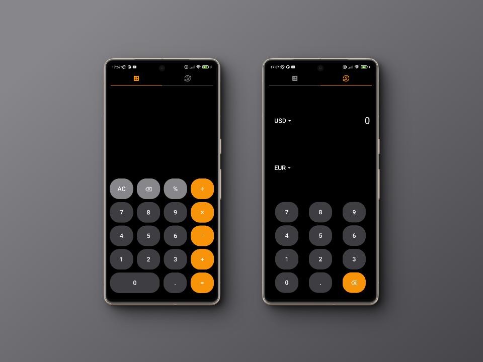

# Calculator

<div align="center">
  
</div>

<br>

A calculator app for Desquared interview.

<br>


## App Overview

The calculator application, developed using Flutter, offers seamless cross-platform functionality, ensuring compatibility with both Android and iOS devices. This app is not only designed for standard calculations but also features a currency converter, integrating a public ***API***. 

This functionality is particularly beneficial for individuals traveling internationally, providing them with up-to-date currency conversion to aid in financial planning and transactions.

<br>

<div align="center">
  
</div>

<br>

### Tech Stack

<br>

This application is developed using the Flutter framework, a UI toolkit by Google.

To support currency conversion functionalities, the app integrates with a public API called FXRates. This API provides real-time exchange rate data, ensuring that currency conversions within the app are accurate and up-to-date. 

<br>

## Project Structure

<br>

### Folder Structure

<br>

```md
.
└── lib/
    ├── models/
    │   └── currency_model.dart
    ├── services/
    │   └── currency_converter_api.dart
    ├── utils/
    │   ├── calc_logic.dart
    │   └── currency_converter_logic.dart
    ├── views/
    │   ├── currency_converter_view.dart
    │   └── simple_calculator_view.dart
    ├── widgets/
    │   ├── calc_button.dart
    │   ├── currency_display_button.dart
    │   └── currency_display_row.dart
    └── main.dart
```

<br>

### Version Control Structure

<br>

Although the project is developed by a single person, version control practices have been implemented throughout its development.

The **Trunk Based Development** model has been adopted, featuring a main branch from which feature branches are created for addressing various issues as they arise.

Whenever a new issue is identified, a corresponding feature branch is established in relation to this issue. This approach facilitates efficient tracking of changes and prevents direct commits to the main branch. Upon completion of a feature, a pull request is initiated to verify merging compatibility and to enable the integration of tests within the pull request cycle.
